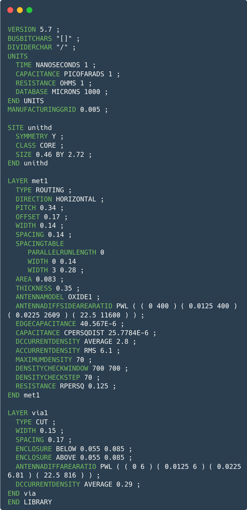
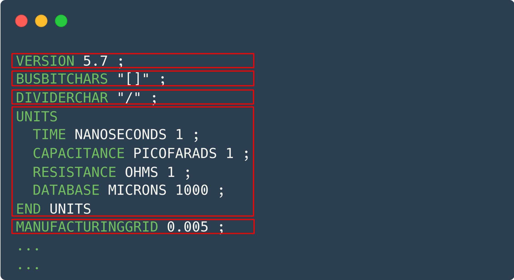
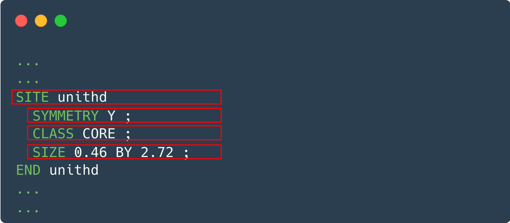
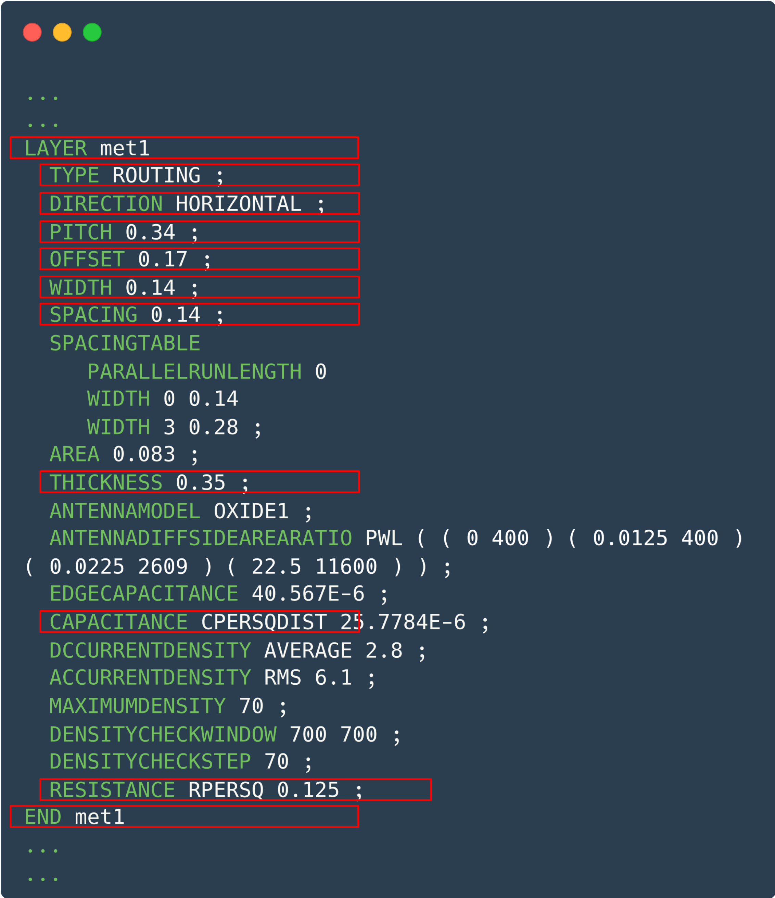
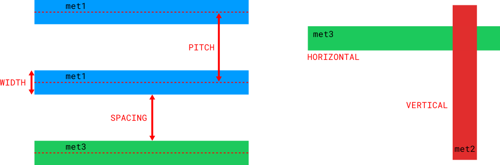
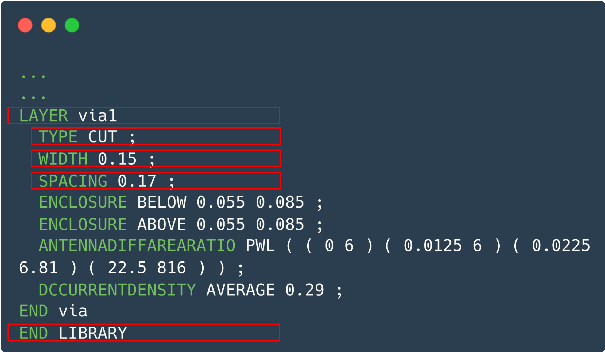
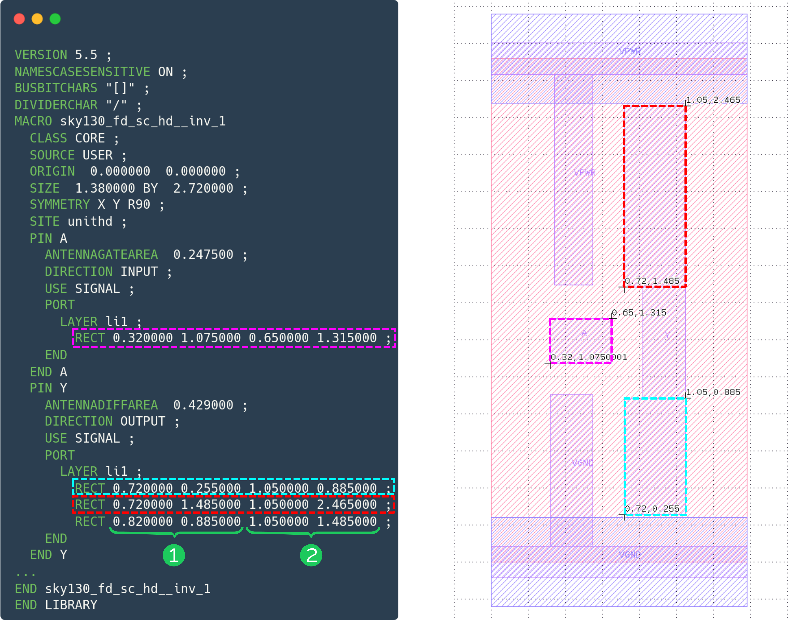
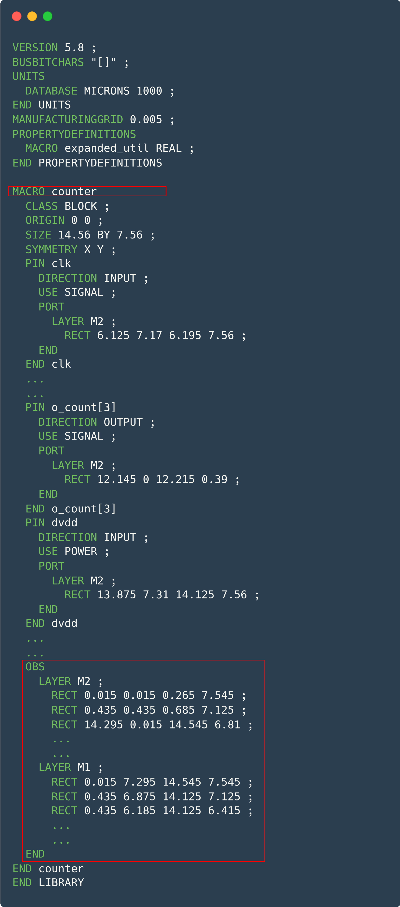
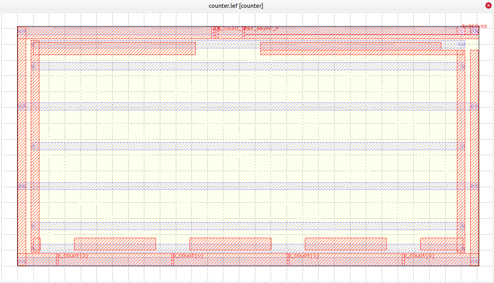
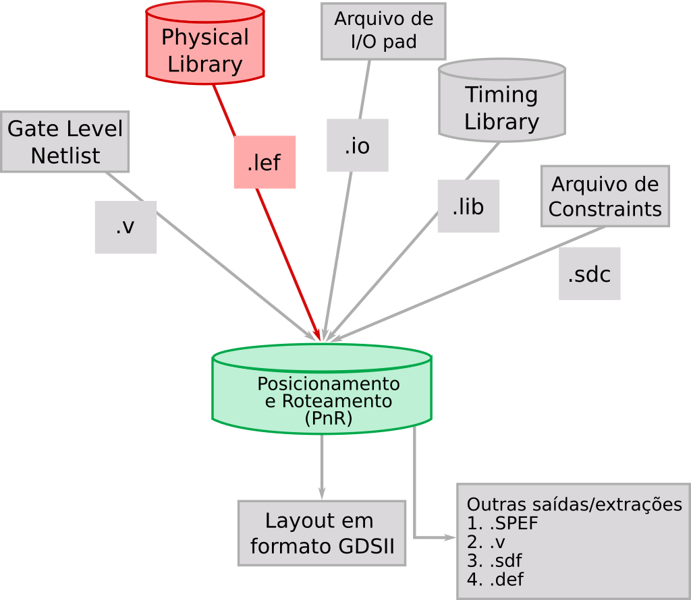

O formato de arquivo Library Exchange Format (LEF) é uma representação abstrata do layout descrita em ASCII, podendo ser lida em qualquer editor de texto. Um arquivo no formato .lef contém somente as informações básicas essenciais para o propósito da ferramenta de CAD em uso. Essa abordagem simplificada na representação visa otimizar o consumo de recursos, como a utilização de memória, durante o processamento do layout de um design. Os dados presentes no arquivo LEF englobam definições de camadas, vias, tipos de site de posicionamento e macros. De modo geral, existem três tipos principais de arquivos LEF:

- **Tech LEF (.lef ou .tlef)**: contém todas as informações de tecnologia, como regras referentes às camadas de metais, vias e site de posicionamento disponíveis para o _Process Design Kit (PDK)_ utilizado.

- **Cell LEF (.lef)**: contém todas as informações físicas abstraídas das células lógicas (std cells) vinculadas ao  _PDK_ utilizado que podem ser aplicadas em um projeto de circuito.

- **Design LEF (.lef)**: corresponde à representação do design já sintetizado fisicamente. Similar ao cell LEF, porém para um bloco projetado.

## Tech LEF

Um arquivo Tech LEF  contém todas as informações de tecnologia para um design, como regras de posicionamento e roteamento, e informações de processo para as camadas. O arquivo pode incluir as seguintes declarações:

[VERSION definição]  
[BUSBITCHARS definição]  
[DIVIDERCHAR definição]  
[UNITS definição]  
[MANUFACTURINGGRID definição]  
[USEMINSPACING definição]  
[CLEARANCEMEASURE definição]  
[PROPERTYDEFINITIONS definição]_  

_[LAYER (Nonrouting) definição  
  | LAYER (Routing) definição]_  

[MAXVIASTACK definição]  
[VIA definição]  
[VIARULE definição]  
[VIARULE GENERATE definição]  
[NONDEFAULTRULE definição]  
[SITE definição]  
[BEGINEXT definição]  
[END LIBRARY]  

Você pode especificar as declarações em qualquer ordem. No entanto, os dados devem ser definidos antes de serem usados. Por exemplo, a declaração UNITS deve ser definida antes de quaisquer declarações que usem valores dependentes dos valores de UNITS. Para o exemplo de Tech LEF abaixo temos:

<div align="center">
    
    <p>
        <em>Exemplo de um arquivo Tech LEF.</em>
    </p>
</div>

<div align="center">
    
    <p>
        <em>Cabeçalho de um arquivo Tech LEF.</em>
    </p>
</div>

**VERSION número:**
Especifica qual versão da sintaxe LEF está sendo usada. O número é uma sequência no formato major.minor[.subMinor], como por exemplo, 5.6 ou 5.7.

**BUSBITCHARS "parDelimitador":**
Especifica o par de caracteres usados para definir os bits de barramento quando os nomes LEF são mapeados para/de outros bancos de dados. Os caracteres devem estar entre aspas duplas. Por exemplo:

&nbsp;&nbsp;&nbsp;&nbsp;BUSBITCHARS "[]":  

Se um dos caracteres de bits de barramento aparecer em um nome de algum elemento do LEF como se fosse um caractere normal, você deve usar uma barra invertida (\) antes do caractere para evitar que o leitor LEF interprete o caractere como um delimitador de bit de barramento. Se você não especificar a declaração BUSBITCHARS no seu arquivo LEF, o valor padrão é "[]".

**DIVIDERCHAR "caractere":**
Especifica o caractere usado para expressar hierarquia quando os nomes no LEF são mapeados para/de outros bancos de dados. O caractere deve estar entre aspas duplas. Por exemplo:

&nbsp;&nbsp;&nbsp;&nbsp;DIVIDERCHAR "/":

Se o caractere de divisão aparecer em um nome de algum elemento do LEF como se fosse um caractere normal, você deve usar uma barra invertida (\) antes do caractere para evitar que o leitor LEF interprete o caractere como um delimitador de hierarquia.
Se você não especificar a declaração DIVIDERCHAR no seu arquivo LEF, o valor padrão é "/".

```text
UNITS  
    [TIME NANOSECONDS fatorDeConversao ;]  
    [CAPACITANCE PICOFARADS fatorDeConversao ;]  
    [RESISTANCE OHMS fatorDeConversao ;]  
    [POWER MILLIWATTS fatorDeConversao ;]  
    [CURRENT MILLIAMPS fatorDeConversao ;]  
    [VOLTAGE VOLTS fatorDeConversao ;]  
    [DATABASE MICRONS fatorDeConversaoLEF ;]  
    [FREQUENCY MEGAHERTZ fatorDeConversao ;]  
END UNITS
```

**UNITS  
&nbsp;&nbsp;&nbsp;&nbsp;[TIME NANOSECONDS fatorDeConversao ;]  
&nbsp;&nbsp;&nbsp;&nbsp;[CAPACITANCE PICOFARADS fatorDeConversao ;]  
&nbsp;&nbsp;&nbsp;&nbsp;[RESISTANCE OHMS fatorDeConversao ;]  
&nbsp;&nbsp;&nbsp;&nbsp;[POWER MILLIWATTS fatorDeConversao ;]  
&nbsp;&nbsp;&nbsp;&nbsp;[CURRENT MILLIAMPS fatorDeConversao ;]  
&nbsp;&nbsp;&nbsp;&nbsp;[VOLTAGE VOLTS fatorDeConversao ;]  
&nbsp;&nbsp;&nbsp;&nbsp;[DATABASE MICRONS fatorDeConversaoLEF ;]  
&nbsp;&nbsp;&nbsp;&nbsp;[FREQUENCY MEGAHERTZ fatorDeConversao ;]  
END UNITS**

O campo UNITS define as unidades de medida no LEF. Os valores indicam como interpretar os números encontrados ao longo do arquivo.

**MANUFACTURINGGRID valor:**
Define a grade de fabricação para o projeto. A grade de fabricação é usada para alinhamento das geometrias. Quando especificado, formas e células são posicionadas em locais que se ajustam à grade de fabricação.

<div align="center">
    
    <p>
        <em>Definição de site em um arquivo Tech LEF.</em>
    </p>
</div>

**SITE nomeDoSite  
&nbsp;&nbsp;&nbsp;&nbsp;CLASSE {PAD | CORE} ;  
&nbsp;&nbsp;&nbsp;&nbsp;[SYMMETRY {X | Y | R90} ... ;]  
&nbsp;&nbsp;&nbsp;&nbsp;[ROWPATTERN {nomeDoSiteAnterior orientaçãoDoSite} ... ;]  
&nbsp;&nbsp;&nbsp;&nbsp;SIZE largura BY altura ;  
FIM nomeDoSite**  

O campo SITE fornece a grade mínima de posicionamento para um conjunto de stdcells, como I/O, core, block, analógico, digital, short, tall, e assim por diante. Todas as std cell precisam ter largura e altura múltiplas do tamanho do site.

**SYMMETRY {X | Y | R90}:**
Indica quais orientações de site são equivalentes. Os sites em uma determinada linha têm a mesma orientação que a linha.

**CLASS {PAD | CORE}:**
Especifica se o site é um site de pad de I/O ou um site de core.

**SIZE largura BY altura:**
Especifica as dimensões do site local na orientação normal (ou norte), em micrômetros.

<div align="center">
    
    <p>
        <em>Definição de camada de metal no Tech LEF.</em>
    </p>
</div>

Os campos LAYER definem as camadas de roteamento presentes na tecnologia e que podem ser usadas no bloco a ser projetado. Cada camada é definida atribuindo-lhe um nome e regras de design. É necessário definir as camadas de roteamento separadamente, com suas próprias declarações de atributos. Você deve definir as camadas em ordem de processo de baixo para cima. Por exemplo:

&nbsp;&nbsp;&nbsp;&nbsp;poly 		masterslice  
&nbsp;&nbsp;&nbsp;&nbsp;cut01 	cut  
&nbsp;&nbsp;&nbsp;&nbsp;met1 		routing  
&nbsp;&nbsp;&nbsp;&nbsp;cut12 	cut  
&nbsp;&nbsp;&nbsp;&nbsp;met2		routing  

**LAYER nomeDaCamada:**
Especifica o nome da camada. Esse nome é usado em referências posteriores à camada.

**DIRECTION {HORIZONTAL | VERTICAL | DIAG45 | DIAG135}:**
Especifica a direção, de preferência, de roteamento do metal. As ferramentas de roteamento automático tentam rotear usando a direção de preferência de uma camada.

**PITCH {distância | xDistancia yDistancia}:**
Especifica a distância de roteamento necessário trilhas da mesma camada. O PITCH é usado para gerar a grade de roteamento (as trilhas DEF).

**WIDTH distancia:**
Especifica valores de largura do fio, em micrômetros. É possível especificar mais de uma largura de fio. Se forem especificados vários valores de largura, eles devem ser especificados em ordem crescente. 

**SPACING distancia:**
Especifica o espaçamento mínimo padrão, em micrômetros, permitido entre duas geometrias de nets diferentes.

As regras de espaçamento se aplicam ao espaçamento entre pino e fio (pin-to-wire), obstrução e fio (obstruction-to-wire), via e fio (via-to-wire), e entre fios (wire-to-wire). Esses requisitos especificam o espaçamento mínimo permitido por padrão entre duas geometrias em nets diferentes. A figura Fig. 2 dá alguns exemplos das propriedades apresentadas para o Tech LEF dessa sessão.


<div align="center">
    
    <p>
        <em>Exemplo das regras das camadas de metal no Tech LEF.</em>
    </p>
</div>

Para conectar entre diferentes camadas de metal, precisamos da camada de poliéster (poly) juntamente com as camadas de metal que iremos conectar. Esses são basicamente chamados de VIAs. As vias podem ter apenas uma conexão (single cut) ou vários pontos de conexão (multi cut) entre as diferentes camadas de metais. Os atributos de uma via no LEF são parecidos com as dos metais. 

<div align="center">
    
    <p>
        <em>Exemplo das regras das vias no Tech LEF.</em>
    </p>
</div>

Por padrão todo arquivo LEF deve terminar com a declaração de END LIBRARY.

## Cell LEF

Um arquivo LEF de biblioteca de células (std cell LEF) contém as informações das células lógicas que para um dado Process Design Kit (PDK). Um arquivo LEF de std cells pode incluir as seguintes declarações:

[VERSION definição]  
[BUSBITCHARS definição]  
[DIVIDERCHAR definição]  
[VIA definição]  
[SITE definição]  
[MACRO definição]  
[PIN definição]  
[OBS definição]  
[BEGINEXT definição]  
[END LIBRARY] 

<div align="center">
    
    <p>
        <em>Exemplo de um arquivo Macro LEF.</em>
    </p>
</div>

As declarações no arquivo cell LEF representam as geometrias que constituem o layout das std cells da biblioteca do PDK. Cada retângulo representado no arquivo está associado a uma camada (LAYER) de metal e é definido por um conjunto de dois pontos com coordenadas xy. Esses dois pontos representam os vértices diagonalmente opostos da geometria, sendo o primeiro par de coordenadas o ponto inferior esquerdo e o segundo par o ponto superior direito.

## Design LEF

O arquivo Design LEF corresponde a uma representação abstrata do design já sintetizado fisicamente. Esse LEF é similar ao cell LEF, porém aplicado a um bloco projetado. Nesse caso, o bloco inteiro é considerado uma macro.

<div align="center">
    
    <p>
        <em>Exemplo de um arquivo Design LEF.</em>
    </p>
</div>

**OBS  
&nbsp;&nbsp;&nbsp;&nbsp;LAYER layerName  
&nbsp;&nbsp;&nbsp;&nbsp;RECT xy xy ;  
END**  

O campo _OBS_ define um conjunto de obstruções (também chamadas de bloqueios) na macro. Normalmente, obstruções impedem o roteamento, exceto quando um pino se sobrepõe a uma obstrução (a geometria da porta sobrepõe a obstrução). Por exemplo, é possível definir um retângulo grande como obstrução de met1 e ter uma porta met1 no meio da obstrução. A porta ainda pode ser acessada por uma via, se a via estiver completamente dentro da porta.


<div align="center">
    
    <p>
        <em>Exemplo da view abstrata de um design.</em>
    </p>
</div>

#### Etapas do Digital Flow que usam o arquivo LEF

O arquivo no formato .lef é usado principalmente na etapa de posicionamento e roteamento (PnR) durante a síntese física (Physical Synthesis) no fluxo digital. Nessa fase, o layout abstrato do circuito é criado, incluindo o posicionamento dos componentes, roteamento das interconexões e definição das camadas de metal e vias. 

<div align="center">
    
    <p>
        <em>Diagrama da etapa do fluxo digital que usa arquivos LEF.</em>
    </p>
</div>

O arquivo .lef contém informações essenciais sobre as dimensões e características físicas dos componentes, bem como alguns detalhes sobre as camadas de metal, vias, regras de espaçamento, largura das trilhas e outras informações relevantes para a implementação física do circuito. Portanto, o arquivo .lef é usado para orientar a ferramenta de projeto físico na geração do layout final do circuito.

#### Referencias

<a href="https://www.ispd.cc/contests/18/lefdefref.pdf" class="link-offset-2 link-offset-3-hover link-underline link-underline-opacity-0 link-underline-opacity-75-hover !important">https://www.ispd.cc/contests/18/lefdefref.pdf</a>. Acessado em 24-Jul-2023

<a href="http://coriolis.lip6.fr/doc/lefdef/lefdefref/LEFSyntax.html." class="link-offset-2 link-offset-3-hover link-underline link-underline-opacity-0 link-underline-opacity-75-hover !important">http://coriolis.lip6.fr/doc/lefdef/lefdefref/LEFSyntax.html.</a>. Acessado em 24-Jul-2023
