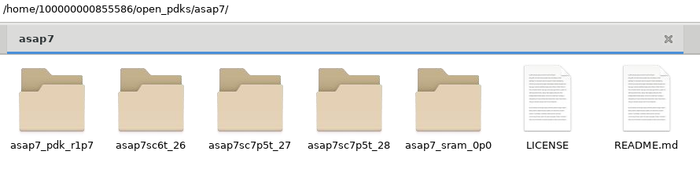
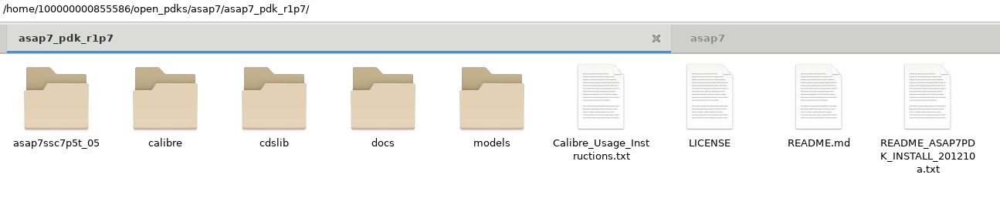
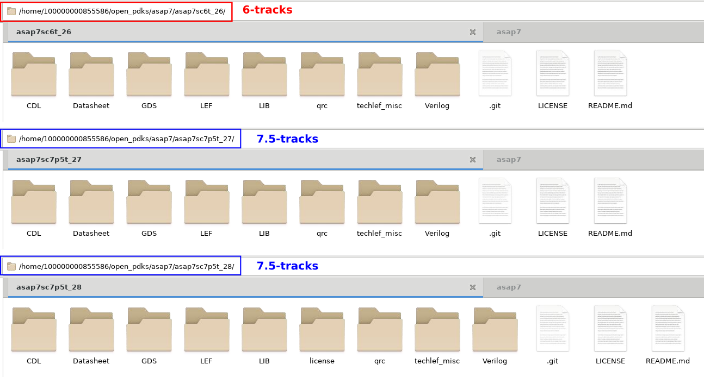
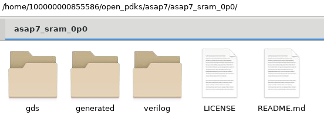
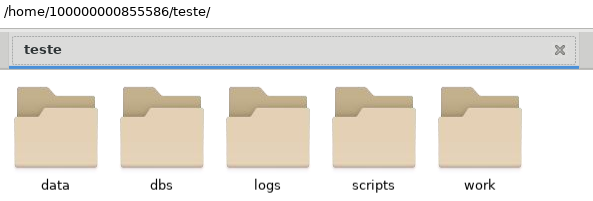
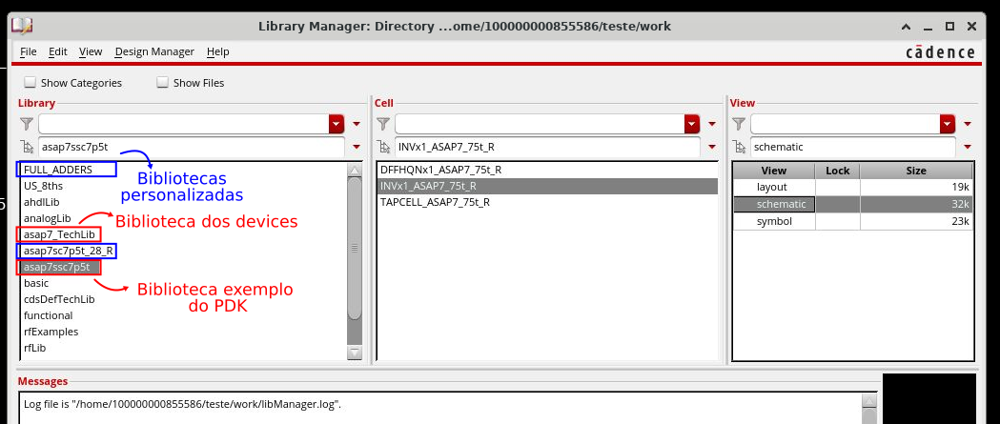

O ASAP7 é um Process Design Kit (PDK) acadêmico desenvolvido pela Arizona State University (ASU) para pesquisa e ensino em design de circuitos integrados na tecnologia de 7 nm. Ele foi projetado para fornecer um ambiente de desenvolvimento realista, baseado em previsões de tecnologia futuras, mas sem os detalhes proprietários encontrados em PDKs comerciais.

Esse PDK inclui modelos de transistores, regras de projeto físico, bibliotecas padrão (standard cells), arquivos de extração e simulação elétrica, permitindo o desenvolvimento de circuitos digitais e analógicos. Ele é amplamente utilizado para pesquisa em baixo consumo de energia, desempenho otimizado e novas arquiteturas de VLSI (Very Large Scale Integration).

Por ser um PDK acadêmico, o ASAP7 facilita o acesso de pesquisadores e estudantes a um ambiente de design avançado, permitindo explorar desafios e inovações na manufatura de semicondutores em tecnologia sub-10nm.

#### Introdução ao PDK ASAP7nm
Em seguida, vamos à análise do conteúdo do PDK do ASAP7nm. A estrutura de arquivos do ASAP7nm é a seguinte:

    
    

        <em>1. Diretórios ASAP7nm PDK.</em>
    

<pre style="background-color: #1e1e1e; color: #ffffff; padding: 10px; border-radius: 5px;">
open_pdks/
└── asap7
    ├── asap7_pdk_r1p7
    ├── asap7sc6t_26
    ├── asap7sc7p5t_27
    ├── asap7sc7p5t_28
    ├── asap7_sram_0p0
    ├── LICENSE
    └── README.md
</pre>

Em mais detalhes temos:

<pre style="background-color: #1e1e1e; color: #ffffff; padding: 10px; border-radius: 5px;">
<b>asap7/</b>
├── <b>asap7_pdk_r1p7</b>
│   ├── asap7ssc7p5t_05
│   ├── calibre
│   ├── Calibre_Usage_Instructions.txt
│   ├── cdslib
│   ├── docs
│   ├── LICENSE
│   ├── models
│   ├── README_ASAP7PDK_INSTALL_201210a.txt
│   └── README.md
├── <b>asap7sc6t_26</b>
│   ├── CDL
│   ├── Datasheet
│   ├── GDS
│   ├── LEF
│   ├── LIB
│   ├── LICENSE
│   ├── qrc
│   ├── README.md
│   ├── techlef_misc
│   └── Verilog
├── <b>asap7sc7p5t_27</b>
│   ├── CDL
│   ├── Datasheet
│   ├── GDS
│   ├── LEF
│   ├── LIB
│   ├── LICENSE
│   ├── qrc
│   ├── README.md
│   ├── techlef_misc
│   └── Verilog
├── <b>asap7sc7p5t_28</b>
│   ├── CDL
│   ├── Datasheet
│   ├── GDS
│   ├── LEF
│   ├── LIB
│   ├── license
│   ├── LICENSE
│   ├── qrc
│   ├── README.md
│   ├── techlef_misc
│   └── Verilog
├── <b>asap7_sram_0p0</b>
│   ├── gds
│   ├── generated
│   ├── LICENSE
│   ├── README.md
│   └── verilog
├── LICENSE
└── README.md
</pre>

#### asap7_pdk_r1p7/ (Núcleo do PDK)
Este diretório contém os arquivos centrais do PDK, incluindo regras de projeto, modelos de dispositivos e documentação.

    
    

        <em>2. Diretórios asap7_pdk_r1p7 PDK.</em>
    

- <b>asap7ssc7p5t_05/</b> – Biblioteca OpenAccess (OA) de exemplo (standard cell).
- <b>calibre/</b>  – Place holder para arquivos para verificação física (DRC, LVS, etc.) usando a ferramenta Calibre da Siemens.
- <b>Calibre_Usage_Instructions.txt</b>  – Instruções sobre como usar o Calibre para checagens de regras de projeto (DRC) e correspondência de esquemático e layout (LVS).
- <b>cdslib/</b>  – Biblioteca OA dos  devices para o ambiente Cadence Virtuoso.
- <b>docs/</b>  – Documentação técnica do PDK.
- <b>LICENSE</b>  – Licença específica para essa versão do PDK.
- <b>models/</b>  – Contém modelos SPICE dos transistores, fundamentais para simulação elétrica.
- <b>README_ASAP7PDK_INSTALL_201210a.txt</b>  – Instruções de instalação do PDK.
- <b>README.md</b>  – Informações gerais sobre o diretório do PDK

#### asap7sc<>/ Bibliotecas de Células Padrão
Os diretórios <b>asap7sc6t_26/</b>, <b>asap7sc7p5t_27/</b> e <b>asap7sc7p5t_28/</b> contêm bibliotecas padrão (standard cells) usadas para síntese lógica e layout físico de circuitos digitais. A asap7sc6t_26 é uma bibliotecas de células para o processo de de 6 trilhas de metais (6-track) e as asap7sc7p5t_27 e asap7sc7p5t_28 são para 7.5 trilhas. 

    
    

        <em>3. Diretórios das bibliotecas de células.</em>
    

Cada um desses diretórios contém:
- <b>CDL/</b> – Arquivos CDL (Circuit Description Language) para verificação elétrica e extração de netlists.
- <b>Datasheet/</b> – Especificações técnicas das células padrão.
- <b>GDS/</b> – Arquivos GDSII para o layout físico das células, usados em ferramentas de layout.
- <b>LEF/</b> – Arquivos LEF (Library Exchange Format), que contêm informações sobre o posicionamento e roteamento das células.
- <b>LIB/</b> – Arquivos LIB (Liberty Format), usados para caracterização do desempenho das células (atraso, consumo de energia, etc.).
- <b>LICENSE</b> – Licença para a biblioteca específica.
- <b>qrc/</b> – Arquivos para extração de parasitas, usados na análise de atraso e integridade do sinal.
- <b>README.md</b> – Informações sobre a biblioteca.
- <b>techlef_misc/</b> – Arquivos adicionais Tech LEF para regras de roteamento.
- <b>Verilog/</b> – Modelos Verilog para simulação lógica e síntese.

#### asap7_sram_0p0/ (Memória SRAM)
Este diretório contém informações sobre blocos de memória SRAM no ASAP7.

    
    

        <em>4. Diretórios da bibliotecas de memórias.</em>
    

Os arquivos incluem: 

- <b>gds/</b> – Arquivos GDSII do layout da SRAM.
- <b>generated/</b> – Contém algumas versões geradas de alguns arquivos de memória.
- <b>LICENSE</b> – Licença para uso da SRAM.
- <b>README.md</b> – Informações sobre o design da SRAM.
- <b>verilog/</b> – Modelos Verilog para simulação da SRAM.

#### Configurar o PDK nas ferramentas da Cadence

Para simular o PDK, você precisa passar por um processo simples de instalação. Especificamente, vá até cdslib/setup, edite set_pdk_path.csh e altere o PDKdirectory na linha setenv PDK_DIR PDKdirectory para o caminho da sua própria instalação do PDK.

<pre style="background-color: #1e1e1e; color: #ffffff; padding: 10px; border-radius: 5px;">
$ setenv PDK_DIR /opt/PDKs/ASAP_7nm/asap7_pdk_r1p7
</pre>

#### Configuração do Workspace

Para organizar melhor a área de trabalho (workarea), crie uma pasta para o projeto e, dentro dela, os seguintes diretórios:

- <b>data/</b> → Contém <b>dados</b>, <b>modelos</b> e <b>arquivos de configuração</b> do ambiente.
- <b>dbs/</b> → Armazena <b>bibliotecas de design criadas</b> ao longo do projeto.
- <b>logs/</b> → Guarda <b>arquivos de log</b> gerados durante o processo de execução.
- <b>scripts/</b> → Onde ficam os <b>scripts utilizados pelas ferramentas</b> do projeto.
- <b>work/</b> → Diretório principal onde você realiza o trabalho e executa as tarefas.

Além disso, eu gosto de utilizar <b>Makefiles</b> para organizar o fluxo de trabalho. Assim, posso definir <i>targets</i> específicos para chamar os scripts de cada etapa do projeto.

A estrutura do <i>workspace</i> ficará assim:

    
    

        <em>5. Diretórios do workspace.</em>
    

<pre style="background-color: #1e1e1e; color: #ffffff; padding: 10px; border-radius: 5px;">
teste/
├── data      # Arquivos de configuração, modelos e dados do ambiente
│   └── cds.lib
├── dbs       # Bibliotecas de design criadas   
├── logs      # Arquivos de log da execução
├── scripts   # Scripts utilizados no fluxo de design
│   └── Makefile
└── work      # Diretório de trabalho principal
    └── Makefile -> ../scripts/Makefile
</pre>

O <b>cds.lib</b> é um arquivo de configuração usado pelo Virtuoso para definir e gerenciar bibliotecas de design no ambiente de desenvolvimento de um projeto de circuitos integrados. Ele especifica os caminhos das bibliotecas usadas no projeto, permitindo que o Virtuoso saiba onde encontrar células, esquemáticos, layouts e outros dados necessários.

O arquivo <b>cds.lib</b>  contém comandos em texto simples para definir e incluir bibliotecas. Para utilizar o ASAP7, crio um arquivo cds.lib no diretório /data, onde adiciono uma linha para incluir o cds.lib do próprio PDK, localizado em <PDK_DIR>/asap7_pdk_r1p7/cdslib/setup/cds.lib. Isso garante que todas as bibliotecas padrão do PDK (devices e biblioteca de exemplo) sejam carregadas automaticamente. Também defino as minhas bibliotecas personalizadas.

<pre style="background-color: #f0f0f0; padding: 10px; border-radius: 5px;">
INCLUDE /home/100000000855586/open_pdks/asap7/asap7_pdk_r1p7/cdslib/setup/cds.lib
DEFINE asap7sc7p5t_28_R  /home/100000000855586/open_pdks/asap7/asap7sc7p5t_28/OA/asap7sc7p5t_28_R
DEFINE FULL_ADDERS  /home/100000000855586/TCC/asap7/dbs/FULL_ADDERS/
</pre>

O INCLUDE é usado para incluir outros cds.lib ao atual, garantindo acesso aos dispositivos do ASAP7.
O DEFINE especifica novas bibliotecas personalizadas, como células padrão (asap7sc7p5t_28_R) e designs específicos (FULL_ADDERS).

Com essa configuração do cds.lib, ao abrir o Virtuoso, ele reconhecerá automaticamente todas as bibliotecas descritas no arquivo, nesse caso tanto as do PDK ASAP7 quanto as do projeto.

No entanto, além do cds.lib, também é necessário configurar o arquivo <b>display.drf</b>. Esse arquivo define as cores e padrões utilizados pelo Virtuoso para exibir as camadas de metais e outros elementos do processo de fabricação no ambiente de layout.

#### Configurando o display.drf

Para garantir que o Virtuoso exiba corretamente as camadas do ASAP7, é preciso utilizar o display.drf fornecido pelo próprio PDK.
Uma maneira eficiente de fazer isso é criando um target no Makefile para gerar links simbólicos para os arquivos necessários, diretamente no diretório /work do projeto. Isso evita cópias desnecessárias e mantém o ambiente sincronizado com o PDK.

Exemplo de Makefile

    <button id="copyButton" onclick="copyToClipboard()" 
        style="position: absolute; top: 10px; right: 10px; background: #4CAF50; color: white; border: none; padding: 5px 10px; cursor: pointer; border-radius: 5px; font-size: 14px;">
        Copiar
    </button>
    
        Copiado!
    
    <pre id="codeBlock" style="background-color: #1e1e1e; color: #ffffff; padding: 10px; border-radius: 5px; overflow-x: auto;">
################################################ 
## Variables definition
################################################ 
# Semaphores directory
VPATH=make

# Directory Variables
SCRIPTS_DIR=../scripts
LOG_DIR=../logs
RPT_DIR=../rpt
DATA_DIR=../data

# Display file directory path needs to be reviewed for each PDK tech installation
DISPLAY_DIR=$(HOME)/open_pdks/asap7/asap7_pdk_r1p7/cdslib/setup

# CDS init file directory path needs to be reviewed for each PDK tech installation
CDS_INIT=$(DISPLAY_DIR)/cdsinit

################################################
## Targets
################################################

## All STEPS
all: $(STEPS)

## Help
help:
	@echo "======================================================="
	@echo "   Makefile Targets                                    "
	@echo "======================================================="
	@echo "          setup : Setup Run Directory                  "
	@echo "          clean : Removes all temporary files          "
	@echo "          reset : Reset makefile targets               "
	@echo "======================================================="
	@echo "   Makefile Options                                    "
	@echo "======================================================="
	@echo "       VPATH : Make directory    (default make)        "
	@echo "    DATA_DIR : Data directory    (default ../data)     "
	@echo " SCRIPTS_DIR : Script directory  (default ../scripts)  "
	@echo "     LOG_DIR : Logfile directory (default ../logs)     "
	@echo "     RPT_DIR : Reports directory (default ../rpt)      "
	@echo " DISPLAY_DIR : PDK directory                           "
	@echo "======================================================="

.PHONY: clean reset  

## Setup
setup:
	@/bin/mkdir -p $(VPATH)
	@/bin/touch $(VPATH)/$@
	# Creating necessary links: layers display, CDS lib, and init
	@ln -sf $(DISPLAY_DIR)/display.drf .
	@ln -sf $(CDS_INIT) .cdsinit
	@ln -sf $(DATA_DIR)/cds.lib .
	@ln -sf $(DISPLAY_DIR)/cdsenv .cdsenv
</pre>

Neste exemplo:
- Criamos um <b>link simbólico</b> para o <b>cds.lib</b>, garantindo que as bibliotecas do PDK sejam carregadas.
- Criamos um <b>link simbólico</b> para o <b>display.drf</b>, garantindo que as camadas do processo sejam exibidas corretamente no Virtuoso.
- Criamos links simbólicos para outros arquivos necessários localizados no diretório de setup do PDK (.cdsinit e .cdsenv)

#### Execução do Makefile
Para configurar o ambiente, basta executar no terminal o comando:

<pre style="background-color: #1e1e1e; color: #ffffff; padding: 10px; border-radius: 5px;">
$ make setup
</pre>

Isso criará os links simbólicos e configurará o ambiente de design para uso com o PDK ASAP7. Ao executar o Virtuoso dentro do diretório /work, que agora contém os links simbólicos, ele reconhecerá automaticamente as bibliotecas definidas no cds.lib, garantindo acesso aos dispositivos e células do PDK ASAP7, além de carregar as configurações do display.drf, permitindo que as camadas de metais e outros elementos do layout sejam exibidos corretamente com as cores e padrões apropriados, como mostrado na figura a seguir. 

    
    

        <em>6. Virtuoso Library Manager.</em>
    

