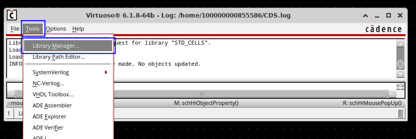
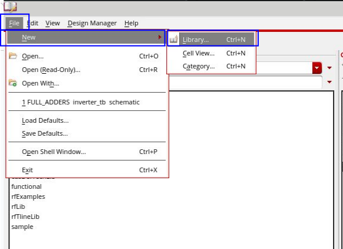
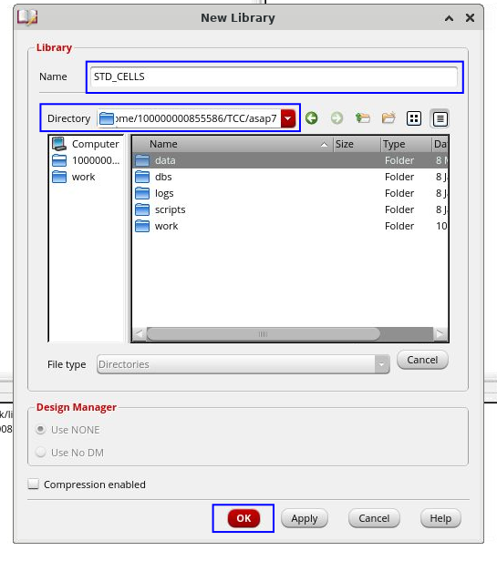
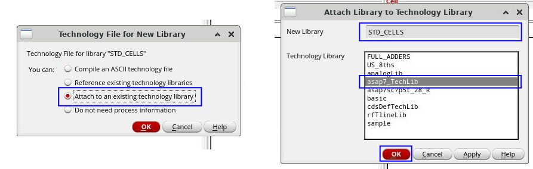
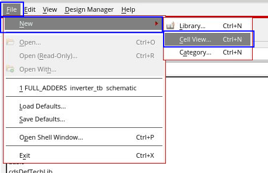
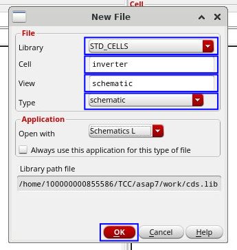
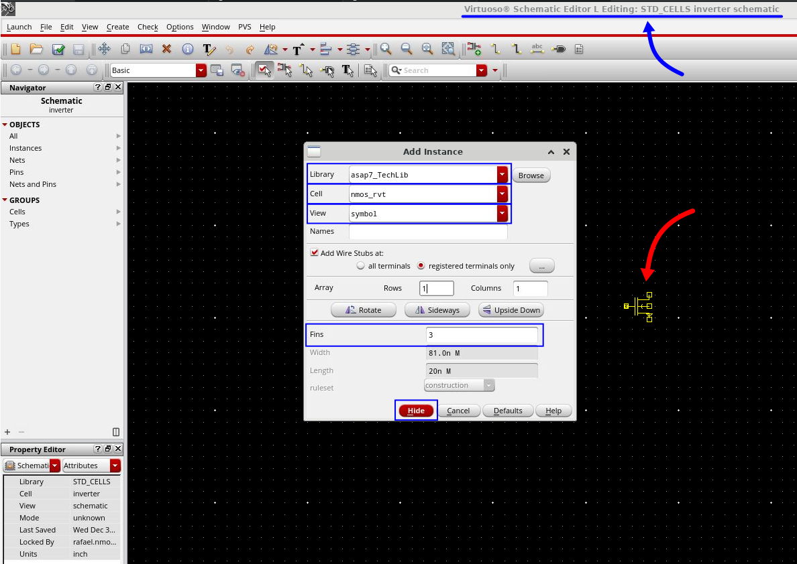
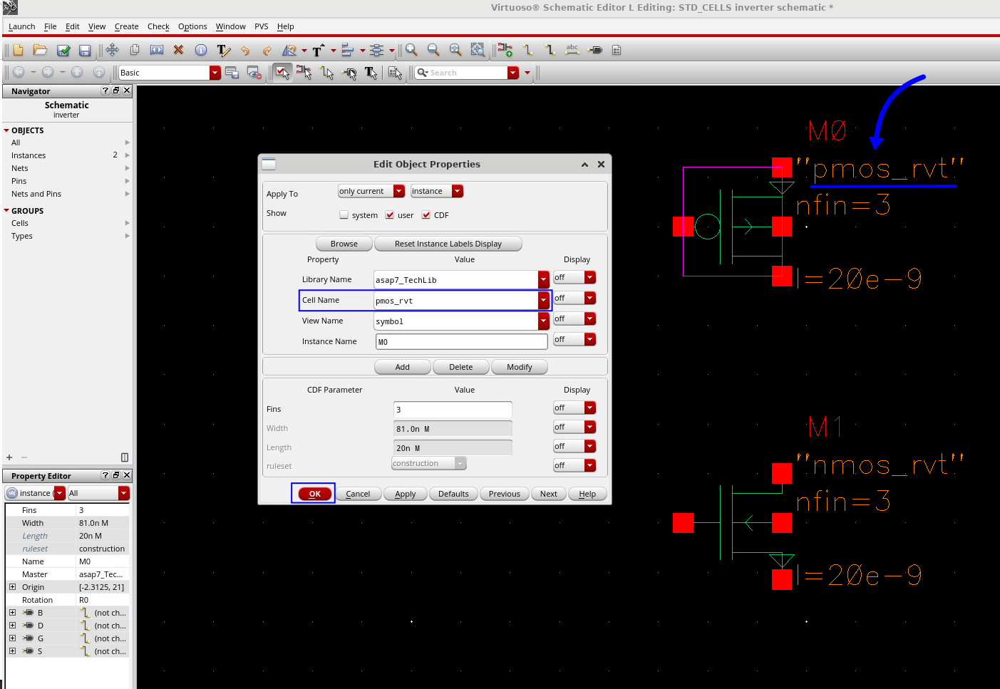

Neste tutorial, iremos projetar nosso próprio circuito para explorar o ambiente do Virtuoso utilizando o PDK ASAP 7nm FinFET. Passaremos pelo processo de criação de uma célula inversora (inverter), destacando as etapas principais do design esquemático e as mudanças mais importantes na forma de executar simulações com o Spectre e o Virtuoso em conjunto.

#### 1. Introdução a simulação com o PDK ASAP7nm

Abra um terminal no diretório do seu ambiente de projeto e execute o seguinte comando para iniciar o Virtuoso:

Em seguida, vamos à análise do conteúdo do PDK do ASAP7nm. A estrutura de arquivos do ASAP7nm é a seguinte:

<pre style="background-color: #1e1e1e; color: #ffffff; padding: 10px; border-radius: 5px;">
$ virtuoso &
</pre>

Se ainda não configurou o ambiente, siga as instruções detalhadas no artigo deste blog, onde explico como preparar o ambiente para o PDK ASAP7 e o Virtuoso corretamente.

Se ainda não configurou o ambiente, siga as instruções detalhadas no artigo
    <a href="{{ '/asap7-pdk/' | relative_url }}" style="color: #4CAF50; text-decoration: none;  text-decoration: underline;">
        Configuração do PDK ASAP7nm para o Virtuoso
    </a> deste blog.

#### 2.Crie uma nova biblioteca para o seu design.

Para começar o design do circuito, é necessário criar uma nova biblioteca no Virtuoso. Essa biblioteca servirá como um espaço de trabalho onde armazenaremos os esquemáticos, layouts e símbolos do nosso projeto. Ao criar a biblioteca, certifique-se de associá-la ao PDK ASAP7 para garantir acesso aos modelos corretos dos dispositivos. No <i>Command Interpreter Window (CIW)</i> vá no menu <b><i>Tools > Library Manager</i></b> para abrir o gerenciador de bibliotecas do Virtuoso (<i>Library Manager</i>).

    
    

        <em>1. Interface do Library Manager.</em>
    

No <i>Library Manager</i>, vá até o menu <b><i>File > New > Library</i></b> e crie uma nova biblioteca. 

    
    

        <em>2. Criando uma noba biblioteca.</em>
    

Uma nova janela irá abrir e você poderá escolher um nome de sua preferência para a biblioteca. No campo <b><i>Directory</i></b>, defina o local onde deseja salvar a biblioteca e clique em <b>OK</b>.

    
    

        <em>3. Nomeando nova biblioteca de design.</em>
    

Após confirmar, uma nova janela será exibida com opções para associar a biblioteca a uma tecnologia existente. Selecione <b><i>Attach</i></b> to an existing technology library e clique em <b>OK</b>. Em seguida, uma janela pop-up será aberta solicitando a escolha da biblioteca de tecnologia. Selecione <b><i>asap7_Techlib</i></b> e confirme clicando em <b>OK</b>. Isso garantirá que sua nova biblioteca utilize os modelos e parâmetros do PDK ASAP7.

    
    

        <em>4. Associando uma biblioteca de tecnologia a nova biblioteca de design.</em>
    

#### 3. Criar uma nova célula e visão esquemática
Após criar a biblioteca com a tecnologia ASAP7 associada, abra o <b><i>Library Manager</i></b>. Em seguida, selecione <b><i>File > New > Cell View</i></b>.
Nesta etapa, vamos criar a view esquemática do nosso inversor de exemplo, que será utilizado como entrada para as simulações do circuito.

    
    

        <em>5. Criando nova cell view.</em>
    

Na janela que abrir, selecione a biblioteca criada, o seu esquemático será dentro dessa biblioteca, escolha também um nome para a nova célula, como <b><i>inverter</i></b>, e defina o tipo como <b><i>schematic</i></b>. Por fim, clique em <b>OK</b> para criar o arquivo e iniciar o design do esquemático no Virtuoso.

    
    

        <em>6. Nomeando nova view de esquemático.</em>
    

#### 4. Projetando o circuito inversor

No <b><i>Virtuoso Schematic Editor</i></b>, pressione a tecla <b><i>"I"</i></b> para adicionar uma instância. Na janela de seleção, escolha a biblioteca <b><i>asap7_TechLib</i></b> e, em seguida, selecione a célula <b><i>nmos_rvt</i></b>.

Antes de posicionar o transistor, <b>altere o número de fins de 1 para 3</b>. Como em transistores FinFET não podemos ajustar diretamente a largura (width), controlamos esse parâmetro pelo número de fins. Cada fin equivale a uma largura efetiva de 27nm, então, ao aumentar o número de fins para n, ampliamos a largura efetiva do transistor n vezes. O comprimento do transistor, por padrão, já é configurado com o valor mínimo permitido pelo processo, que é 20nm.

    
    

        <em>7. Instânciando devices no esquemático.</em>
    

<b>Clique com o botão esquerdo do mouse na área de design para posicionar o transistor</b> NMOS selecionado. Em seguida, clique novamente para adicionar um segundo NMOS. Após isso pressione a tecla "esc" para ir para a ferramenta de seleção. Aperte a tecla "F" para dar um zoom e o esquemático ajustar ao tamanho da tela. Como uma célula inversora é composta por dois transistores – um PMOS e um NMOS – precisamos editar um dos transistores adicionados para que ele se torne um PMOS. 

Para isso, <b>selecione um dos transistores já posicionados</b> clicando sobre ele com o botão esquerdo do mouse. No teclado, pressione a tecla Q para abrir a janela <b><i>Edit Object Properties</i></b>, onde é possível modificar as propriedades do componente. Na opção <b><i>Cell Name</i></b>, altere o device para <b><i>pmos_rvt</i></b> e clique em <b>OK</b>.

Após essa alteração, observe que o símbolo do dispositivo na área de design será atualizado automaticamente, assim como seu nome. Agora, temos todos os transistores necessários para continuar projetando a célula inversora.

    
    

        <em>8. Editando devices já instaciados.</em>
    

#### Criando as nets 

Para conectar os diferentes componentes no esquemático precisar criar linhas (nets) entre os terminais dos dispositivos. Para isso pressione a tecla "w" e com o mouse trace as linhas da com base no esquematico do inversor. A figura abaixo ilustra como deve ficar. Para criar um segmento basta clicar com o mouse nos pontos desejados do grid da tela.
